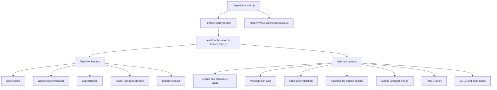

# Public Records Platform QA Assessment

This repository contains a Playwright JavaScript suite for the PublicRecordsData.us. The suite uses Firefox Nightly for demo purposes.
## Setup

```sh
npm install
npx playwright install firefox
npm test
```

Useful scripts:

```sh
npm test
npm run test:headed
npm run report
```

## Browser Target

The Playwright project is named `nightly` and points directly at the bundled Nightly executable:

```text
~/Library/Caches/ms-playwright/firefox-1532/firefox/Nightly.app/Contents/MacOS/firefox
```

If the Playwright browser cache changes, update `nightlyExecutablePath` in `playwright.config.js`.

## Assignment Coverage

Phase 1: Existing Ticket Audit

- Covered in `BUGS.md` under `Ticket Audit: PR-4092`.
- The audit records what was tested, observed checkout behavior, missing ticket
  details, why the ticket is not implementation-ready, and a suggested rewrite.
- The automated checkout tests preserve the key evidence: spaced card input is
  normalized and incomplete checkout remains blocked.

Phase 2, Scenario 1: Search Funnel & Processing Interface Verification

- Covered by search initiation, empty/whitespace boundaries, FCRA disclosure,
  age verification, notice, service-agreement flow, keyboard submission, and
  back-navigation checks.
- UI/design coverage includes accessible names, image alt checks, title checks,
  dialog focusability, and horizontal-overflow checks.
- Wait strategy uses Playwright web-first assertions, URL assertions, and
  `domcontentloaded` navigation. There are no fixed sleeps in the test suite.
- The public flow did not expose a stable loading/progress component to assert
  directly, so the suite validates the state transitions that follow processing
  instead of binding to a transient implementation detail.

Phase 2, Scenario 2: Data Layout, Sorting & Pagination Stability

- The requested results matrix, sorting dropdowns, and pagination controls were
  not visible in the observed public funnel. This is documented in `BUGS.md`.
- The closest visible matrix was package selection, which is covered through
  tier selection, summary updates, plan-route mapping, desktop layout checks, and
  mobile smoke coverage.
- If a results route or seeded test account becomes available, this should become
  a separate results-layout spec covering sorting by Age, Location, and History,
  pagination, no duplicated rows, and no dropped cells after DOM reordering.

Phase 2, Scenario 3: Checkout Gate Field Validation

- Covered by plan-tier selection, invoice/summary assertions, service-agreement
  gating, checkout field errors, terms enforcement, mobile checkout layout, and
  reload behavior after partial form entry.
- Zip-code validation is treated as a gray area because checkout exposes a hidden
  `Billing Address` search field rather than a visible standalone zip/postal
  input. The suite asserts the visible billing-address error and documents the
  assumption in `BUGS.md`.
- Expired-date validation is partly constrained by the UI because past years are
  not selectable. The suite asserts that past years are unavailable and verifies
  that selecting a past month in the current year, such as January 2026 when the
  current month is later in 2026, displays the checkout expiration error.
- Payment safety is enforced by never satisfying all valid checkout requirements
  at once and never submitting a complete payment-ready form.

## Test Strategy

The suite is built as a risk-based end-to-end assessment rather than a broad
snapshot of every visible page. The highest-risk behavior is the monetized user
journey: a visitor searches for a person, accepts legally sensitive disclosure
gates, selects a package, accepts the service agreement, and reaches checkout.
Those steps are tested together because regressions in page handoffs are more
important than isolated rendering checks for this assessment.

The strategy is split into three layers:

- **Critical path automation:** the public user funnel from search through safe
  checkout validation.
- **Safety and compliance gates:** FCRA language, service-agreement handoff,
  terms enforcement, and payment-safety boundaries.
- **Experience smoke coverage:** accessibility, keyboard navigation, responsive
  layout, and browser-specific risk areas.

Selectors intentionally avoid generated CSS classes. Tests prefer user-facing
roles, visible text, stable IDs, input labels, and route assertions. This keeps
the suite closer to user behavior and less sensitive to presentation-only
changes.

### Automated Coverage

The current suite covers:

- Broad name search for `John Smith`
- Empty and whitespace-only search boundary checks
- Initial FCRA/search disclosure dialog
- Age verification and notice gates
- Package tier selection
- Package-to-service-agreement route mapping
- Service agreement gate
- Checkout validation without completing payment
- Field-specific checkout validation for malformed card, CVV, and email input
- Accessibility smoke coverage across high-value funnel pages
- Keyboard-only search submission
- Dialog focus and native dialog-state checks
- Desktop horizontal-overflow checks on key pages
- Mobile viewport smoke coverage through package selection
- Mobile viewport smoke coverage at checkout

### Validation Depth

Search and disclosure:

- Confirms the landing page is usable before interacting with it.
- Verifies empty and whitespace-only searches do not open the disclosure dialog.
- Starts a broad identity search and verifies the FCRA disclosure appears.
- Verifies the disclosure includes expected risk language and public-record
  count messaging.
- Confirms browser back navigation returns to a usable search form.
- Uses Playwright state-based waits for the post-search disclosure and route
  transitions instead of fixed timers. The observed public flow did not expose a
  stable loading spinner/progress element worth asserting directly.

Consent and legal gates:

- Verifies age-verification content and terms-of-service messaging.
- Opens the nested FCRA disclaimer and confirms the user can continue.
- Verifies the notice gate blocks progress until the user agrees.
- Verifies the service-agreement gate appears before checkout.
- Verifies checkout is not available from the service-agreement page until the
  agreement action is taken.

Package selection:

- Confirms each package radio option can be selected.
- Confirms each selection changes the visible package summary.
- Confirms each package maps to its expected service-agreement plan route.
- Continues with the single-report plan to keep checkout price assertions stable.
- Verifies checkout summary text for the selected plan.

Checkout validation:

- Audits the reported credit-card spacing issue.
- Confirms spaced card input is normalized on blur.
- Verifies malformed card, malformed CVV, and malformed email errors.
- Verifies current-year expired-month validation.
- Verifies required-field validation blocks progress.
- Verifies terms enforcement blocks progress.
- Treats missing visible zip-code input as a documented product gap.
- Verifies expired years are unavailable rather than forcing an impossible
  expired-card submission through the UI.
- Confirms partial checkout data is cleared after reload.

Accessibility and keyboard behavior:

- Verifies visible controls have accessible names.
- Verifies visible images expose `alt` attributes.
- Verifies pages under test have document titles.
- Verifies keyboard-only users can reach the search field and submit search.
- Verifies disclosure dialog content can receive focus.
- Documents known structural accessibility issues in `BUGS.md` rather than
  hiding all functional signal behind known product failures.

Responsive and browser behavior:

- Checks for horizontal overflow on high-value pages.
- Exercises the package-selection and checkout paths at a mobile viewport.
- Keeps the browser matrix intentionally narrow in this local setup because the
  configured project targets Firefox Nightly only.

### Quality Gates

The suite uses Playwright's web-first assertions and URL/content waits instead of
fixed timers. That keeps waits tied to real page state and reduces timing noise.

Payment safety is a hard boundary:

- The tests never enter a real card.
- The tests never satisfy all checkout requirements at once.
- The tests never submit a fully valid payment form.
- The checkout test intentionally validates blocking errors instead of payment
  authorization behavior.

Known product gaps are documented separately in `BUGS.md`. When an issue is
already present in production, the suite either documents it as an audit finding
or gates only the surrounding behavior that should remain stable.

### Recommended Future Tests

These are useful next additions if the scope grows or the application exposes
test hooks:

- **Search boundaries:** single-name search, names with hyphens or apostrophes,
  unusually long names, and city/state filters if available.
- **Results experience:** sorting, pagination, filtering, result-card content,
  and zero-result handling. This was not automated because the observed public
  flow did not expose a separate sortable/paginated results matrix.
- **Checkout field matrix:** non-numeric CVV, unsupported card brand, address
  autocomplete failure, past-year expiration through a test hook, and zip/postal
  validation once a visible zip field or test hook exists.
- **Direct-route protection:** gated routes such as package, service agreement,
  and checkout are currently reachable directly and are documented in `BUGS.md`.
  Once fixed, add regression tests proving those routes redirect or block access
  until prior consent steps are complete.
- **Session behavior:** reload, new tab, back/forward navigation, and expired
  session behavior between package selection and checkout.
- **Network resilience:** slow search response, blocked analytics scripts,
  failed address-autocomplete provider, and payment-provider timeout handling.
- **Accessibility depth:** add `@axe-core/playwright`, focus-trap checks for
  dialogs, color-contrast review, screen-reader name/description checks, and
  reduced-motion behavior if the UI animates state transitions.
- **Cross-browser matrix:** run Chromium, Firefox, and WebKit in CI, with special
  attention to native `<dialog>`, masked credit-card fields, select controls,
  autofill, and mobile viewport behavior.

## Test Architecture



The helper functions model the actual funnel order and keep repeated navigation
logic out of individual assertions. This is intentionally a small, single-spec
suite today; if the assessment grows, the next clean split would be:

- `tests/flows/` for reusable funnel navigation helpers
- `tests/assertions/` for shared validation helpers like overflow checks
- separate specs for search/disclosure, package selection, and checkout
- optional API or fixture-level tests for cases that the production UI does not
  expose, such as forced expired-card years

## Accessibility and Browser Coverage

The current accessibility tests are intentionally dependency-free so the suite can
run with only Playwright installed. They are not a replacement for a full WCAG
audit, but they gate regressions that frequently break real users:

- unlabeled visible controls
- missing document title
- visible images without `alt`
- search and disclosure dialogs that cannot be operated from the keyboard
- focus not reaching the expected active controls

During exploration, the site also exposed structural accessibility gaps such as a
missing root document language and missing heading/landmark structure on some
funnel pages. These are tracked in `BUGS.md` as product findings because making
them hard assertions would currently fail every end-to-end path.

Useful next steps if this were expanded beyond the take-home scope:

- Add `@axe-core/playwright` for automated WCAG rule checks on the landing page,
  package page, and checkout page.
- Add Chromium and WebKit projects in CI once the local browser installation issue
  is resolved, because payment forms, masked inputs, native selects, and dialog
  focus handling can differ by engine.
- Add one mobile viewport project, especially for checkout and package selection,
  where layout overflow and sticky payment summaries tend to regress.
- Keep Firefox Nightly as the local project while documenting the pinned browser
  path, but avoid relying on Nightly-only behavior for pass/fail expectations.

## Gray Areas

The assessment asks for zip-code validation. The checkout page exposes a hidden `Billing Address` search field and reports `Billing address can not be blank`, but I did not find a visible standalone zip/postal-code input. I treated billing-address validation as the closest available boundary and documented this in `BUGS.md`.

The assessment also asks for expired-date validation. The year dropdown starts at the current year (`26`) and does not expose past years, but prior months in the current year remain selectable. The suite now verifies both sides of that boundary: past years are unavailable, and a current-year past month returns the checkout expiration error.

The current public funnel did not expose a separate results matrix with sorting and pagination before checkout. I covered the observed package-selection matrix and noted the missing sorting/pagination surface in `BUGS.md`.
