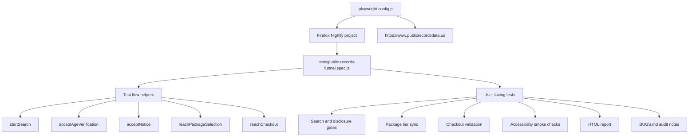

# Public Records Platform QA Assessment

This repository contains a Playwright JavaScript suite for the PublicRecordsData.us. The suite uses Firefox Nightly for demo purposes.
## Setup

```sh
npm install
npx playwright install firefox
npm test
```

Useful scripts:

```sh
npm test
npm run test:headed
npm run report
```

## Browser Target

The Playwright project is named `nightly` and points directly at the bundled Nightly executable:

```text
~/Library/Caches/ms-playwright/firefox-1532/firefox/Nightly.app/Contents/MacOS/firefox
```

If the Playwright browser cache changes, update `nightlyExecutablePath` in `playwright.config.js`.

## Test Strategy

The suite is built as a risk-based end-to-end assessment rather than a broad
snapshot of every visible page. The highest-risk behavior is the monetized user
journey: a visitor searches for a person, accepts legally sensitive disclosure
gates, selects a package, accepts the service agreement, and reaches checkout.
Those steps are tested together because regressions in the handoff between pages
are more important than isolated rendering checks for this assessment.

Selectors intentionally avoid generated CSS classes. Tests prefer user-facing
roles, visible text, stable IDs, input labels, and route assertions. This keeps
the suite closer to user behavior and less sensitive to presentation-only
changes.

Covered paths:

- Broad name search for `John Smith`
- Initial FCRA/disclosure dialog
- Age verification and notice gates
- Package tier selection
- Service agreement gate
- Checkout validation without completing payment
- Accessibility smoke coverage across the same high-value funnel pages

Validation depth:

- The accessibility checks verify title metadata, visible control names, image
  alt coverage, keyboard access to search, and keyboard/focus behavior for
  disclosure dialogs. Structural issues found during this pass are documented in
  `BUGS.md` rather than making every funnel test fail.
- The search test verifies that the first disclosure gate appears, contains the
  expected FCRA language, can be continued, and survives browser back/forward
  style navigation.
- The package test verifies that each visible tier can be selected and that the
  on-page summary changes with the selected tier before continuing to checkout.
- The checkout test verifies the disputed credit-card spacing behavior, required
  field validation, unavailable expired years, terms enforcement, and reload
  behavior for partially entered payment data.
- The suite includes a lightweight horizontal-overflow assertion on major funnel
  pages to catch obvious responsive layout regressions while still keeping the
  focus on functional QA.

The suite uses Playwright's web-first assertions and URL/content waits instead of
fixed timers. Payment safety is enforced by never entering a real usable card,
never checking all checkout requirements, and never submitting a fully valid
payment form.

## Test Architecture



The helper functions model the actual funnel order and keep repeated navigation
logic out of individual assertions. This is intentionally a small, single-spec
suite today; if the assessment grows, the next clean split would be:

- `tests/flows/` for reusable funnel navigation helpers
- `tests/assertions/` for shared validation helpers like overflow checks
- separate specs for search/disclosure, package selection, and checkout
- optional API or fixture-level tests for cases that the production UI does not
  expose, such as forced expired-card years

## Accessibility and Browser Coverage

The current accessibility tests are intentionally dependency-free so the suite can
run with only Playwright installed. They are not a replacement for a full WCAG
audit, but they gate regressions that frequently break real users:

- unlabeled visible controls
- missing document title
- visible images without `alt`
- search and disclosure dialogs that cannot be operated from the keyboard
- focus not reaching the expected active controls

During exploration, the site also exposed structural accessibility gaps such as a
missing root document language and missing heading/landmark structure on some
funnel pages. These are tracked in `BUGS.md` as product findings because making
them hard assertions would currently fail every end-to-end path.

Useful next steps if this were expanded beyond the take-home scope:

- Add `@axe-core/playwright` for automated WCAG rule checks on the landing page,
  package page, and checkout page.
- Add Chromium and WebKit projects in CI once the local browser installation issue
  is resolved, because payment forms, masked inputs, native selects, and dialog
  focus handling can differ by engine.
- Add one mobile viewport project, especially for checkout and package selection,
  where layout overflow and sticky payment summaries tend to regress.
- Keep Firefox Nightly as the local project while documenting the pinned browser
  path, but avoid relying on Nightly-only behavior for pass/fail expectations.

## Gray Areas

The assessment asks for zip-code validation. The checkout page exposes a hidden `Billing Address` search field and reports `Billing address can not be blank`, but I did not find a visible standalone zip/postal-code input. I treated billing-address validation as the closest available boundary and documented this in `BUGS.md`.

The assessment also asks for expired-date validation. The year dropdown starts at the current year (`26`) and does not expose past years, so the automated check verifies that expired years are unavailable rather than forcing an impossible expired date through the UI.

The current public funnel did not expose a separate results matrix with sorting and pagination before checkout. I covered the observed package-selection matrix and noted the missing sorting/pagination surface in `BUGS.md`.
